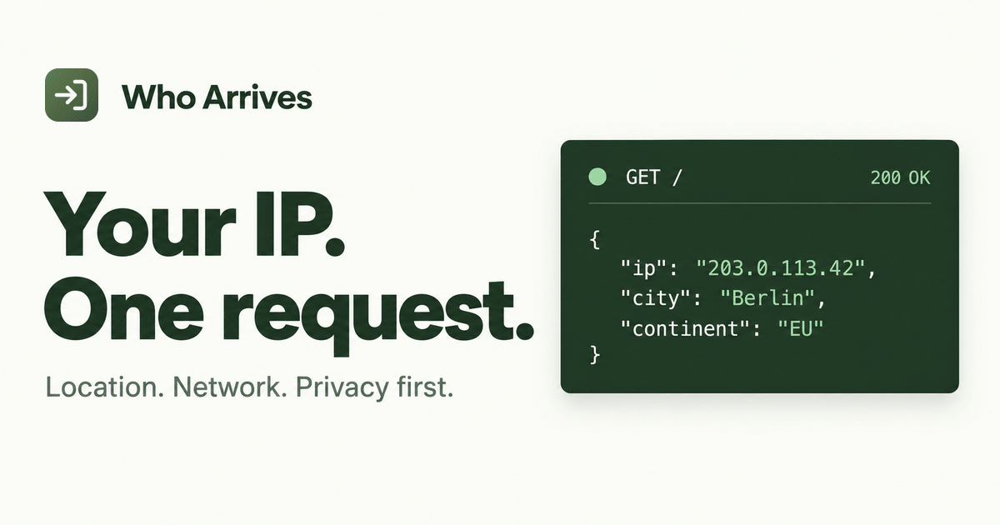

<div align="center">


# Who Arrives

Current client IP, geolocation, and network information — served entirely from Cloudflare Workers.

**Who Arrives** answers one question: *who is arriving at the endpoint right now?* It reads the caller's own connection data that Cloudflare attaches to every request (IP, country, city, coordinates, ASN, …) and returns it as clean JSON. There is no arbitrary IP lookup — you can only look up yourself.



</div>

## Features

- **Single endpoint, zero config** — `GET /` returns everything Cloudflare knows about the current client.
- **Optional enrichment** — request extra fields like country name, flag emoji, IP version, or local time with the `fields` query parameter.
- **Privacy-first by design** — no logging, no storage, no third-party API calls at runtime. Responses are serialized from an explicit allowlist; nothing from `request.cf` or arbitrary headers leaks through. Country enrichment is served from data bundled at build time, not fetched on request.
- **IPv6-aware** — preserves the real IPv6 address even when Cloudflare's Pseudo IPv4 feature overwrites `CF-Connecting-IP`.
- **Correct by construction** — strict input validation, structured cloning of shared records, and a test suite covering parsing, enrichment, and time handling.
- **OpenAPI 3.1** — a complete, generated API spec ships in [`openapi.json`](openapi.json).

## Example

```console
$ curl https://who-arrives-api.fthux.com/
{
  "ip": "203.0.113.42",
  "countryOrRegion": {
    "code": "DE",
    "isEUCountry": true
  },
  "continent": "EU",
  "city": "Berlin",
  "region": { "name": "Berlin", "code": "BE" },
  "postalCode": "10115",
  "location": {
    "latitude": 52.52,
    "longitude": 13.405,
    "timezone": "Europe/Berlin"
  },
  "metroCode": null,
  "asn": { "number": 3320, "organization": "Deutsche Telekom AG" }
}
```

Add enrichment fields:

```console
$ curl "https://who-arrives-api.fthux.com/?fields=names,flag,time"
{
  ...basic fields...,
  "enrichment": {
    "countryOrRegion": { "name": "Germany", "flag": "🇩🇪" },
    "location": { "time": { "date": "2026-09-17", "time": "00:13:31", "utcOffset": "+02:00", ... } }
  }
}
```

## The `fields` parameter

Comma-separated, case-sensitive. Repeated `fields` parameters are merged; unknown fields or unsupported query parameters return `400`.

| Field | Adds |
|---|---|
| `names` | Country/region name and continent name |
| `flag` | Flag emoji |
| `ipVersion` | `IPv4` / `IPv6` |
| `time` | Local date, time, and UTC offset in the client's timezone |
| `capitals` | Capital(s) |
| `currencies` | Currency codes, names, symbols |
| `languages` | Official language codes and names |
| `callingCodes` | Country calling codes (ITU level, e.g. `+1`, not NANP area codes) |
| `all` | Everything above |

## Getting started

Requires Node.js and npm. All commands run against [Wrangler](https://developers.cloudflare.com/workers/), Cloudflare's toolkit.

```bash
npm install

npm run dev          # local dev server at http://127.0.0.1:8787
npm run test         # unit tests
npm run check        # typecheck + tests + deploy dry-run
npm run deploy       # deploy to Cloudflare Workers
```

Point `wrangler.jsonc` at your own domain by editing the `routes` entry, or remove it to use a `workers.dev` subdomain (`workers_dev` is disabled by default here).

### Rebuilding bundled data

Country enrichment data is pre-built into `src/data/`. To refresh it:

```bash
npm run data:build   # fetches pinned upstream data and regenerates src/data/
npm run docs:build   # regenerates openapi.json
```

Upstream revisions, download URLs, and SHA-256 hashes are recorded in `src/data/provenance.json`.

## API reference

The full OpenAPI 3.1 specification lives in [`openapi.json`](openapi.json). Responses are `application/json` with `Cache-Control: private, no-store` and permissive CORS (`Access-Control-Allow-Origin: *`), so you can call it straight from a browser.

Errors are uniform JSON objects:

```json
{ "error": "Unknown field: foo. Supported fields: names, flag, ..., all." }
```

## Design notes

- **Allowlist serialization.** Only explicit, validated fields from `request.cf` are ever emitted. Adding new response fields requires a deliberate code change, not an accidental header passthrough.
- **Honest nulls.** Missing or invalid values are `null`, never inferred. For example, `isEUCountry` is only reported when Cloudflare provides it; it is not guessed outside the EU.
- **No runtime network calls.** All enrichment is computed locally or read from bundled data, so the worker never makes outbound requests that could log or leak client information.
- **Validated input.** Query parameters, coordinates, ASN numbers, and IP formats are all validated before use; malformed input returns `400` instead of passing through.

## Data attribution

Bundled country data is a derivative database of [mledoze/countries](https://github.com/mledoze/countries) (ODbL 1.0); calling codes derive from [Google libphonenumber](https://github.com/google/libphonenumber) (Apache 2.0). Full attribution and upstream license texts are in [`licenses/`](licenses/), pinned sources in `src/data/provenance.json`.

## License

Application code is licensed under [AGPL-3.0-only](LICENSE). The bundled derivative country database is separately licensed under ODbL 1.0 — see [`licenses/README.md`](licenses/README.md).
